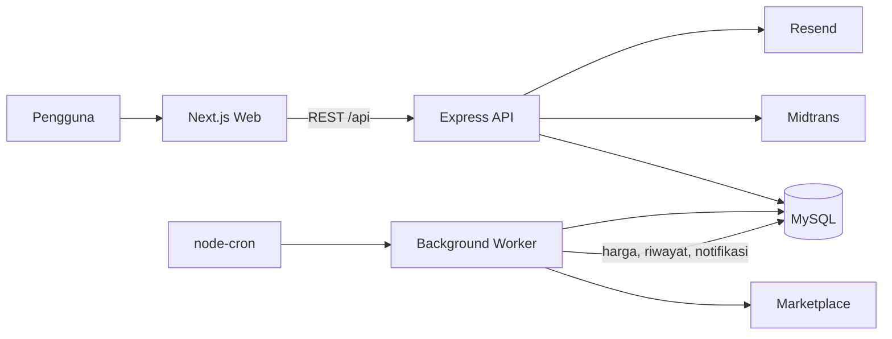
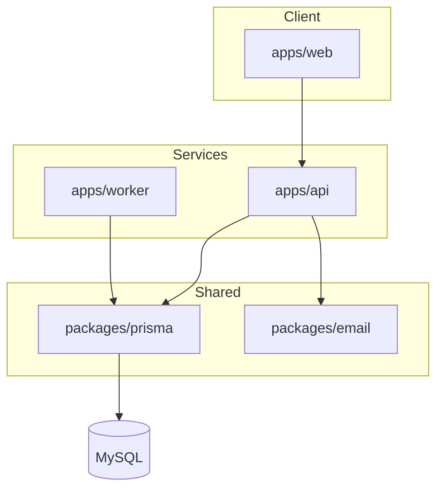
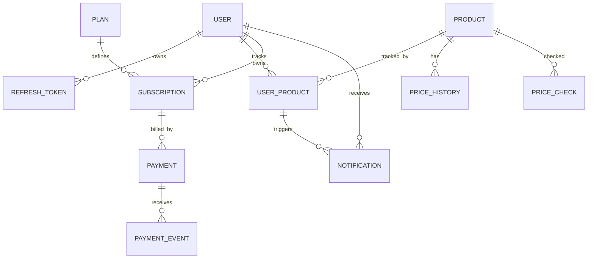
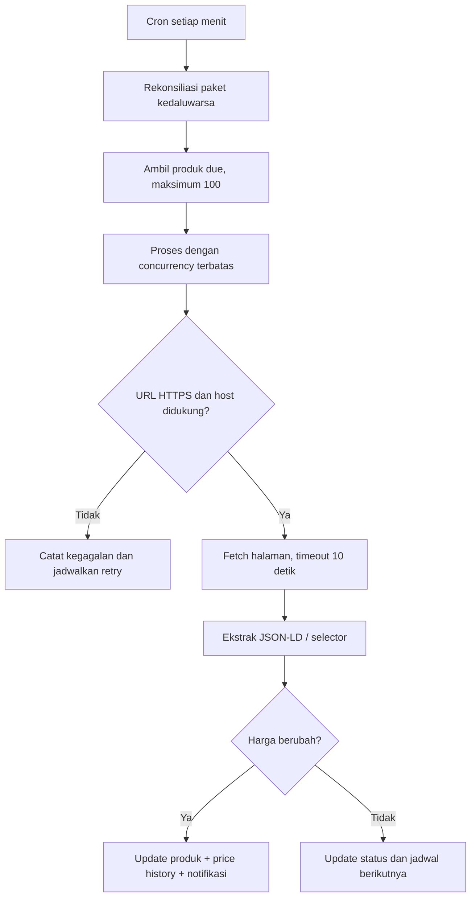
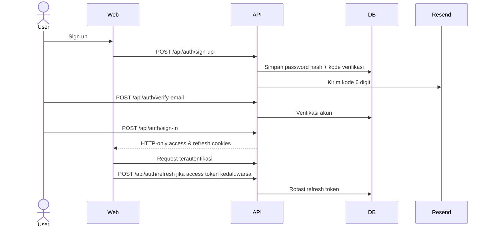
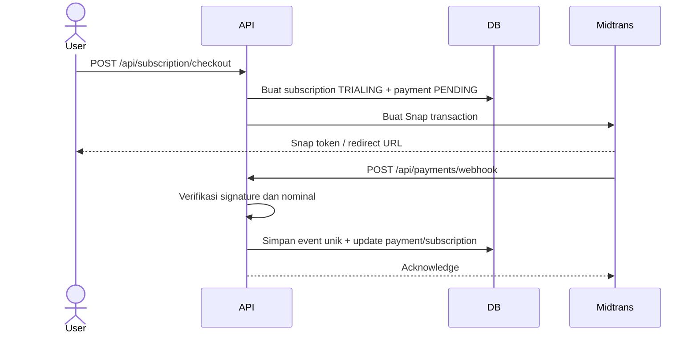
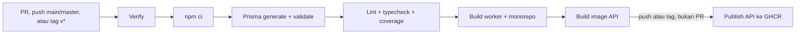

<div align="center">

# 📉 Dipantauin

### Price tracker untuk marketplace Indonesia

Pantau perubahan harga produk, simpan riwayatnya, dan terima notifikasi saat harga mencapai target.

**Next.js 16 • Express 5 • TypeScript • Prisma • MySQL • Docker**

</div>

## 🌟 Overview

Dipantauin membantu pengguna memantau produk dari **Tokopedia, Shopee, dan Blibli** tanpa perlu mengecek setiap halaman secara manual. Pengguna dapat melakukan preview URL, menambahkan produk, menentukan target harga, melihat riwayat harga, dan mengelola notifikasi dalam aplikasi.

REST API menangani autentikasi, produk, paket langganan, pembayaran, dan administrasi. Background Worker mengambil produk yang sudah jatuh tempo, mengekstrak data marketplace, lalu memperbarui harga, jadwal pemeriksaan, riwayat, dan notifikasi secara transaksional.

## ✨ Features

- Preview produk sebelum mulai dilacak
- Pelacakan produk Tokopedia, Shopee, dan Blibli
- Target harga, status pelacakan, dan interval sesuai paket
- Riwayat harga serta log pemeriksaan
- Notifikasi in-app untuk perubahan dan pencapaian target harga
- Verifikasi email serta access/refresh token
- Paket Free dan berbayar dengan checkout Midtrans Snap
- Webhook pembayaran yang tervalidasi dan idempotent
- Dashboard pengguna dan panel admin
- Health check, Swagger UI, rate limiting, CORS, dan Helmet

## 🛠️ Tech Stack

| Area | Teknologi |
|---|---|
| Web | Next.js 16, React 19, Tailwind CSS 4, TanStack Query, Zustand, Axios |
| API | Express 5, Zod, JWT, bcrypt, Swagger UI |
| Worker | Node.js, node-cron, Cheerio |
| Data | MySQL 8.4, Prisma 6 |
| Integrasi | Midtrans Snap, Resend |
| Tooling | npm workspaces, Turborepo, TypeScript, ESLint, Vitest |
| Infrastruktur | Docker, Docker Compose, GitHub Actions, GHCR |

## 📋 Table of Contents

- [Cara Kerja](#-how-it-works)
- [Arsitektur](#️-architecture)
- [Struktur Proyek](#-project-structure)
- [Database](#️-database)
- [Price Monitoring](#️-price-monitoring--worker)
- [Authentication](#-authentication)
- [Subscription & Payment](#-subscription--payment)
- [Environment](#️-environment-configuration)
- [Getting Started](#-getting-started)
- [API](#-api-documentation)
- [Testing](#-testing)
- [CI/CD dan GHCR](#-cicd)
- [Security](#-security)
- [Troubleshooting](#️-troubleshooting)

## 🧩 How It Works



1. Pengguna mendaftar, memverifikasi email, lalu menyimpan URL produk dan target harga.
2. API memvalidasi URL dan menyimpan konfigurasi pelacakan.
3. Worker berjalan setiap menit dan memproses maksimal 100 produk yang telah jatuh tempo.
4. Data terbaru disimpan; riwayat hanya ditambahkan ketika harga berubah.
5. Perubahan penting menjadi notifikasi in-app yang ditampilkan oleh web.

## 🏗️ Architecture



| Komponen | Tanggung jawab |
|---|---|
| `apps/web` | Marketing page, alur auth, dashboard pengguna, dan panel admin |
| `apps/api` | REST API, validasi, aturan bisnis, auth, pembayaran, dan Swagger |
| `apps/worker` | Scheduler, marketplace tracker, retry, dan rekonsiliasi paket |
| `packages/prisma` | Schema, migration, seed, dan Prisma Client bersama |
| `packages/email` | Pengiriman email verifikasi melalui Resend |

## 📁 Project Structure

```text
dipantauin/
├── apps/
│   ├── api/              # Express REST API
│   ├── web/              # Next.js application
│   └── worker/           # Scheduled price checker
├── packages/
│   ├── email/            # Shared email package
│   └── prisma/           # Schema, migration, seed, client
├── .github/workflows/    # CI dan publikasi image API
├── docker-compose.yml    # Production-style stack
├── docker-compose.dev.yml
├── package.json
└── turbo.json
```

## 🗄️ Database



Schema Prisma mencakup pengguna, refresh token, katalog produk, produk yang dilacak, riwayat harga, hasil pemeriksaan, notifikasi, paket, langganan, pembayaran, dan event webhook. Migration berada di `packages/prisma/migrations`.

## ⚙️ Price Monitoring / Worker



Worker mendukung status aktif, unavailable, dan error. Redirect dibatasi, ukuran respons dibatasi 2 MB, dan produk diproses dalam batch dengan concurrency 5. Scheduler mencegah job yang sama tumpang tindih di dalam satu proses worker.

## 🔐 Authentication



Password di-hash dengan bcrypt. Refresh token disimpan sebagai hash SHA-256, dirotasi ketika digunakan, dan dapat dicabut. Endpoint admin memeriksa role serta status pengguna dari database.

## 💳 Subscription & Payment



Paket Free diaktifkan tanpa pembayaran. Checkout berbayar menggunakan Midtrans Snap. Webhook memvalidasi signature SHA-512, nominal transaksi, dan event unik sebelum memperbarui data dalam transaksi database. Pembatalan langganan berlaku pada akhir periode.

## ⚙️ Environment Configuration

Salin `.env.example` sebagai titik awal. Jangan commit file `.env` atau secret asli.

| Grup | Variabel | Keterangan |
|---|---|---|
| Database | `DATABASE_URL` | URL koneksi Prisma |
| Database/Compose | `DB_USER`, `DB_PASSWORD`, `DB_ROOT_PASSWORD`, `DB_NAME`, `DB_PORT` | Kredensial dan port MySQL |
| Application | `NODE_ENV`, `PORT`, `FRONTEND_URL` | Runtime API dan origin CORS |
| Web | `NEXT_PUBLIC_API_URL`, `WEB_PORT` | URL API publik dan port web |
| JWT | `JWT_SECRET`, `JWT_EXPIRES_IN`, `REFRESH_TOKEN_EXPIRES_IN` | Signing key dan masa berlaku token |
| Email | `RESEND_API_KEY`, `EMAIL_FROM` | Email verifikasi |
| Midtrans | `MIDTRANS_SERVER_KEY`, `MIDTRANS_CLIENT_KEY`, `MIDTRANS_IS_PRODUCTION` | Payment gateway |
| Image/port opsional | `API_IMAGE`, `WEB_IMAGE`, `WORKER_IMAGE`, `API_PORT` | Override Docker Compose |

> Variabel berawalan `NEXT_PUBLIC_` dapat terbaca browser. Jangan menaruh secret di dalamnya. Gunakan `JWT_SECRET` acak minimal 32 karakter.

## 🚀 Getting Started

### Prasyarat

- Node.js 22 dan npm 10
- MySQL 8.x untuk local development
- Docker + Docker Compose untuk mode container
- Kredensial Resend dan Midtrans bila alur terkait ingin diuji

### Local Development

```bash
git clone https://github.com/lnrdgnwn/dipantauin.git
cd dipantauin
npm ci

cp apps/api/.env.example apps/api/.env
cp apps/worker/.env.example apps/worker/.env
cp packages/prisma/.env.example packages/prisma/.env
```

Sesuaikan credential database, JWT, Resend, dan Midtrans. Setelah MySQL tersedia:

```bash
npm run db:generate -w @dipantauin/prisma
npm run db:migrate -w @dipantauin/prisma
npm exec -w @dipantauin/prisma -- tsx seeders/index.ts
npm run dev
```

Web tersedia di `http://localhost:3000`, API di `http://localhost:3001/api`, dan Swagger di `http://localhost:3001/swagger`.

### Docker Development

```bash
cp .env.example .env
# Edit seluruh nilai change-me / replace-me terlebih dahulu
docker compose -f docker-compose.dev.yml up --build -d
docker compose -f docker-compose.dev.yml exec api npm run db:migrate -w @dipantauin/prisma
docker compose -f docker-compose.dev.yml exec api npm exec -w @dipantauin/prisma -- tsx seeders/index.ts
docker compose -f docker-compose.dev.yml logs -f
```

Source code di-mount ke container dan aplikasi berjalan dalam watch mode.

### Docker Production-style

```bash
cp .env.example .env
# Gunakan secret production dan URL publik yang benar
docker compose build
docker compose up -d
docker compose ps
```

Compose production-style menjalankan MySQL, API, web, dan worker. Siapkan migration/seed database secara eksternal sebelum menjalankan image production; image runtime API tidak menyertakan Prisma CLI. Konfigurasi ini belum menggantikan hardening serta secret management untuk deployment production sesungguhnya.

## 📖 API Documentation

Swagger UI tersedia saat API aktif:

- UI: `http://localhost:3001/swagger`
- Health liveness: `GET http://localhost:3001/api/health/live`
- Health readiness: `GET http://localhost:3001/api/health/ready`

Endpoint terproteksi menerima access token melalui HTTP-only cookie atau header `Authorization: Bearer <token>`.

## 🔌 Key Endpoints

| Area | Method | Endpoint | Akses |
|---|---|---|---|
| Auth | POST | `/api/auth/sign-up`, `/api/auth/sign-in`, `/api/auth/verify-email` | Public |
| Auth | POST | `/api/auth/refresh`, `/api/auth/sign-out` | Cookie/session |
| Profile | GET/PATCH | `/api/auth/me` | User |
| Product | POST | `/api/products/preview` | User |
| Tracked product | GET/POST | `/api/tracked-products` | User |
| Tracked product | GET/PATCH/DELETE | `/api/tracked-products/:id` | User |
| Price history | GET | `/api/products/:id/price-history` | User |
| Plans | GET | `/api/plans`, `/api/plans/:id` | Public |
| Subscription | GET/POST | `/api/subscription/*` | User |
| Payment | POST | `/api/payments/webhook` | Midtrans |
| Notification | GET/PATCH/DELETE | `/api/notifications/*` | User |
| Admin | GET/POST/PATCH | `/api/admin/*` | Admin |

Daftar dan schema request/response yang lebih lengkap tersedia di Swagger UI. Endpoint `POST /api/tracked-products/:id/check-now` hanya aktif pada mode development.

## 🧪 Testing

```bash
npm test                 # seluruh workspace
npm run test:coverage    # seluruh workspace + laporan coverage
npm run lint
npm run typecheck
npm run db:validate
npm run check            # lint + typecheck + validasi Prisma
```

Test menggunakan Vitest. API mencakup middleware auth, modul bisnis, mutation, dan health integration; worker mencakup aturan penjadwalan, price checker, serta fixture marketplace; web mencakup utility. Turborepo membangun dependency workspace sebelum test yang membutuhkannya.

## 🔄 CI/CD



Workflow GitHub Actions memakai Node.js 22. Job publish hanya berjalan setelah verify berhasil pada event `push`; PR tidak memublikasikan image.

## 📦 GHCR

CI dikonfigurasi untuk membangun dan mendorong **image API saja** ke:

```text
ghcr.io/<repository-owner>/dipantauin-api
```

Tag dapat berupa `latest` pada default branch, branch, commit SHA, atau versi semantik. Konfigurasi workflow tidak dengan sendirinya menjamin image bersifat public atau sudah tersedia; periksa halaman Packages repository dan lakukan `docker login ghcr.io` bila package private.

Untuk memakai image yang sudah tersedia melalui Compose:

```bash
API_IMAGE=ghcr.io/<repository-owner>/dipantauin-api:<tag> docker compose up -d
```

Web dan worker tetap dibangun lokal kecuali `WEB_IMAGE` atau `WORKER_IMAGE` juga diarahkan ke image yang dikelola sendiri.

## 🔒 Security

- Password disimpan sebagai bcrypt hash; refresh token disimpan sebagai SHA-256 hash.
- Cookie auth memakai `HttpOnly`, `SameSite=Lax`, dan `Secure` pada production.
- Helmet, origin CORS terkonfigurasi, JSON limit, dan rate limiter diterapkan di API.
- Role admin dan status akun diverifikasi menggunakan data database.
- Worker hanya menerima HTTPS dari hostname marketplace yang didukung serta memvalidasi redirect.
- Webhook Midtrans memverifikasi signature dan nominal, serta mencegah pemrosesan event ganda.

Repository ini tetap membutuhkan HTTPS, secret manager, rotasi credential, backup database, observability, dan review keamanan sebelum digunakan sebagai layanan production.

## 🛠️ Troubleshooting

### API atau Worker gagal terhubung ke MySQL

Pastikan `DATABASE_URL` menggunakan `localhost` saat berjalan lokal, tetapi hostname `mysql` di dalam Docker Compose. Cek kondisi container dengan `docker compose ps`.

### Prisma Client belum tersedia

```bash
npm run db:generate -w @dipantauin/prisma
npm run db:validate
```

### Browser terkena CORS atau cookie tidak terkirim

Samakan `FRONTEND_URL` dengan origin web secara persis, pastikan `NEXT_PUBLIC_API_URL` menunjuk ke suffix `/api`, dan jangan hilangkan credential cookies pada client/proxy.

### Email verifikasi atau checkout gagal

Periksa `RESEND_API_KEY`, `EMAIL_FROM`, serta Midtrans server/client key dan mode sandbox/production. Webhook Midtrans harus dapat menjangkau endpoint API dari internet.

### Produk gagal diperiksa

Pastikan URL HTTPS berasal dari Tokopedia, Shopee, atau Blibli. Lihat log worker; timeout, redirect yang tidak aman, response terlalu besar, atau perubahan markup marketplace dapat menghasilkan retry.

## 🗺️ Future Improvements
*
- Notification channel tambahan seperti email atau Telegram

## 👨‍💻 Author

**Leonardo Gunawan**
Informatics Engineering — Universitas Sriwijaya

[GitHub](https://github.com/lnrdgnwn)
